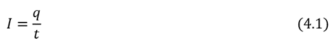
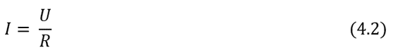
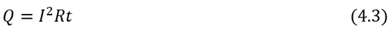
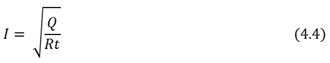
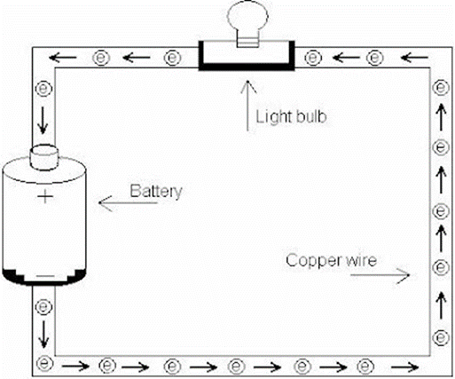
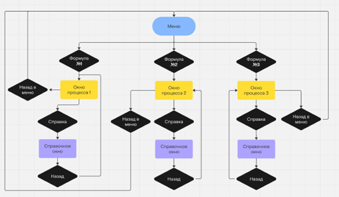
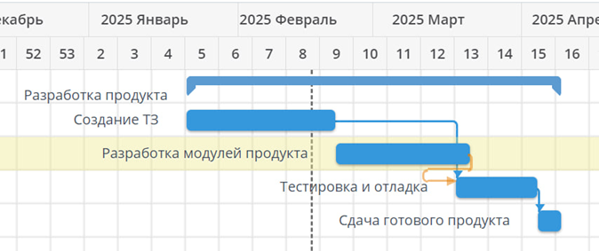

**1. ВВЕДЕНИЕ**

**1.1 Наименование программы**

Наименование программы – «ElectricApp»

**1.2 Краткая характеристика области применения**

Настоящее техническое задание распространяется на разработку программы,
моделирующей электрическую цепь постоянного тока и предоставляющей
наглядную визуализацию процессов, происходящих в ней. Предполагается,
что использовать данную программу будут студенты первого курса при
изучении раздела "Электрический ток" курса физики.

Тема электричества является одной из ключевых в курсе физики, однако
понимание принципов работы электрических цепей и процессов, происходящих
в них, часто вызывает затруднения у учащихся. Для успешного освоения
данной темы необходимо научиться анализировать электрические схемы,
рассчитывать параметры цепи (в данном случае силу тока) и понимать
физические законы, лежащие в основе этих процессов (закон Ома, закон
Джоуля-Ленца).

Существующие программные средства, предназначенные для моделирования
электрических цепей, например, LTSpice или Multisim, являются мощными
профессиональными инструментами с большим набором функций. Использование
таких программ школьниками может быть затруднительным и неэффективным в
учебном процессе.

Разрабатываемая программа предоставит обучающимся интуитивно понятный
инструмент для самостоятельного экспериментирования с электрическими
цепями, позволит наглядно увидеть взаимосвязь между различными
параметрами цепи и поможет глубже понять физические принципы работы
электрического тока. Это позволит учащимся проверить свои знания и
закрепить полученный материал на практике.

**2. ОСНОВАНИЕ ДЛЯ РАЗРАБОТКИ**

Задание на проектирование в рамках изучения МДК 02.01 «Технология
разработки программного обеспечения» по специальности 09.02.07
«Информационные системы и программирование», факультет СПО №12 СПБГУАП.

**3. НАЗНАЧЕНИЕ РАЗРАБОТКИ**

Программа предназначена для визуализации процессов, происходящих в
электрической цепи, и выяснения зависимости между параметрами. Данное
приложение может быть использовано для помощи студентам при изучении
раздела «Электричество» в курсе физики.

**4. ТРЕБОВАНИЯ К ПРОГРАММЕ ИЛИ ПРОГРАММНОМУ ИЗДЕЛИЮ**

**4.1. Требования к функциональным характеристикам**

4.1.1. Программа должна обеспечивать возможность выполнения следующих
функций:

1) открытие меню, в котором происходит выбор формулы, по которой будет
   происходить подсчёт силы тока:

   - формула для расчёта силы тока (4.1),
   - формула закона Ома (4.2),
   - формула закона Джоуля-Ленца (4.3) (формула для расчета силы тока,
     выходящая из этого закона (4.4)).

   

   где
   I – сила тока (А);
   q – электрический заряд (Кл);
   t – время, за которое протекает ток по электрической цепи (с).

   

   где
   I – сила тока (А);
   U – напряжение (В);
   R – сопротивление (Ом).

   

   где
   Q – количество теплоты (Дж);
   I – сила тока (А);
   R – сопротивление (Ом);
   t – время протекания тока (с).

   

   где
   I – сила тока (А);
   Q – количество теплоты (Дж);
   R – сопротивление (Ом);
   t – время протекания тока (с).

2) ввод, изменение и хранение параметров;

3) графическое наглядное изображение процесса протекания электрического
   тока и влияние различных параметров на это;

   Планируется визуализировать процесс протекания тока в виде провода, по
   которому идут электроны, как представлено схематично на рисунке 4.1. В
   зависимости от величины силы тока, электроны будут менять своё поведение
   – двигаться медленнее/быстрее, что позволит наглядно изображать
   зависимость различных параметров на силу тока.

   

4) вычисление силы тока и вывод его значения.

4.1.2. Исходные данные:

- при выборе элемента меню «Формула для расчета силы тока»:
  1) электрический заряд (Кл);
  2) время, за которое протекает ток по электрической цепи (с);

- при выборе элемента меню «Закон Ома»:
  1) напряжение (В);
  2) сопротивление (Ом);

- при выборе элемента меню «Закон Джоуля-Ленца»:
  1) количество теплоты, выделяемое за время работы тока (Дж);
  2) сопротивление (Ом);
  3) время, за которое протекает ток по электрической цепи (с);

Выходными данными является значение силы тока (А).

**4.2. Требования к надежности**

4.2.1. Предусмотреть контроль вводимой информации – программа не должна
допускать ввод неположительных и нечисловых значений.

4.2.2. Предусмотреть блокировку некорректных действий пользователя –
действий, которые могут привести к некорректному поведению программы и
сбоям (ввод некорректных данных, перегрузка системы, нарушение логики
работы, неправильное использование интерфейса).

**4.3. Требования к составу и параметрам технических средств**

4.3.1. Система должна работать на IBM-совместимых персональных
компьютерах.

4.3.2. Минимальная конфигурация:

1) тип процессора – Intel Core i3 и выше;
2) объем оперативного запоминающего устройств – 4 ГБ и более.

**4.4. Требования к информационной и программной совместимости**

Система должна работать под управлением семейства операционных систем
Win32 (Windows 11, Windows 10, Windows 8, Windows 7).

Язык программирования: С#.

Программные средства и инструменты: Visual Studio – полнофункциональная
IDE для работы с WinForms, WPF, MAUI и другими технологиями.

**5. ТРЕБОВАНИЯ К ПРОГРАММНОЙ ДОКУМЕНТАЦИИ**

Разрабатываемые программные модули должны быть самодокументированы, т.
е. тексты программ должны содержать все необходимые комментарии.

Программа должна включать справочную информацию об основных терминах
соответствующего раздела физики («Электричество»), о работе с
приложением и подсказки пользователю.

В состав сопровождающей документации должны входить:

1) Пояснительная записка на 10-15 листах, содержащая описание
   разработки.

2) Графическая часть:
   1. Схема программной системы. На рисунке 4.2 представлена схема
      движения пользователя, наглядный разветвлённый сценарий его
      взаимодействия с приложением. Показаны точки входа в сценарий,
      все переходы и открывающиеся окна. На рисунке 4.3 представлены
      простые серые макеты окон приложения, показывающий, где и какие
      элементы интерфейса должны располагаться. Это черновой дизайн
      будущего приложения.

   

   

**6. ТЕХНИКО-ЭКОНОМИЧЕСКИЕ ПОКАЗАТЕЛИ**

Программа может быть использована как в учебных заведениях, так и для
самостоятельного изучения, что способствует доступности образования.
Ожидается, что использование данной программы повысит уровень понимания
тематики "Электрический ток" на 20-30% по сравнению с традиционными
методами обучения. Ожидается высокий уровень удовлетворенности студентов
и преподавателей от использования программы, что будет способствовать ее
популяризации. Ожидаемый срок разработки программы – 3 месяца.

**7. СТАДИИ И ЭТАПЫ РАЗРАБОТКИ**

На старте разработки ПО сложно планировать: распределять задачи в
команде и определять, сколько времени займёт каждый этап работ. Если
неправильно распределить ресурсы, можно не успеть выполнить задачи
вовремя. Поэтому важное первое действие – это спланировать весь процесс
разработки, определить ключевые стадии и этапы. Только тщательное
планирование и правильно подобранная методология позволят получить
качественный продукт, который будет востребован и принесет пользу,
поможет сократить сроки реализации и минимизировать расходы.

**7.1 Создание технического задания**

Создание технического создания – довольно трудоемкий и длительный
процесс. Хорошее ТЗ требует четкости и полноты в описании всех
требований, функций, ограничений и этапов разработки. Оно обеспечивает
чёткую постановку целей (что должно быть реализовано, какие задачи
решает продукт), способствует определению требований (что должно делать
приложение, требования к самой разработки, реализации, характеристикам
программы, доступные технологии, сроки), позволяет минимизировать риски
(помогает выявить возможные проблемы на ранних этапах и избежать лишних
переделок и доработок, экономя время и деньги).

Техническое задание является основой для разработки – четкое
руководство для разработчиков по созданию системы, которое позволяет
проверять соответствие готового продукта изначальным требованиям и
упрощает процесс тестирования и приёмки проекта заказчиком.

**7.2 Разработка модулей продукта**

Разработка модулей продукта – это процесс создания отдельных
компонентов или частей программной системы, которые выполняют
определённые функции и могут работать как независимо, так и в рамках
более сложной системы. Под модулями понимаются различные элементы,
которые обеспечивают нужную функциональность, интегрируются с другими
частями системы и могут быть разработаны, протестированы и поддержаны
отдельно. Это очень важный процесс, заключающийся в прописке всего
функционала, создания графического интерфейс и позволяющий создать
рабочую программу.

**7.3 Тестировка и отладка**

Тестировка и отладка – два ключевых процесса в разработке ПО, которые
обеспечивают качество, стабильность и правильную работу приложения. В
результате тестирования программа проверятся на наличие ошибок, проблем
с производительностью и других дефектов. Это важный этап, который
помогает удостовериться, что приложение выполняет свои функции корректно
и в соответствии с требованиями. Отладка – это устранения ошибок в
коде, в системе, который обычно происходит после тестирования, если были
обнаружены дефекты.

Это очень важный этап, обеспечивающий эффективность работы программы, ее
будущий успех, популярность и востребованность, предотвращая ошибки,
сбои, непредвиденные и некорректные случаи.

**7.4 Сдача готового продукта**

Этап сдачи готового продукта – это последний этап в процессе
разработки ПО, на котором продукт передается заказчику или конечному
пользователю для использования. Данный этап включает в себя действий,
обеспечивающие успешное завершение проекта и его принятие.

**7.4.1 Финальное тестирование и проверка качества**

Проводятся последние проверки продукта, чтобы убедиться, что все
функциональные требования выполнены и нет критических багов.
Проверяется, что исправления не привели к новым проблемам.

**7.4.2 Подготовка документации**

Данный процесс включает в себя создание пользовательской документации,
инструкций по использованию, а также технической документации, которая
описывает архитектуру, API, настройки и другие детали, полезные для
разработки, поддержки и развития продукта. Документация должна быть
ясной и доступной для конечных пользователей и технических специалистов.

3. **Приемка заказчиком**

   Заказчик проверяет продукт на соответствие требованиям и
   функциональности. Если продукт соответствует ожиданиям, заказчик
   подписывает акт приемки, подтверждая завершение проекта. В случае
   обнаружения проблем или недочетов, проект может быть возвращен на
   доработку.

   Этап сдачи готового продукта критичен для того, чтобы проект официально
   завершился и был признан завершенным как с точки зрения заказчика, так и
   с точки зрения разработчиков.

**8. ПОРЯДОК КОНТРОЛЯ И ПРИЕМКИ**

**8.1. Общие положения**

8.1.1. Контроль и приемка программы визуализации постоянного тока
осуществляются в соответствии с требованиями настоящего технического
задания и ГОСТ 19.201-78.

8.1.2. Целью контроля и приемки является проверка соответствия
разработанного программного продукта установленным требованиям, а также
его пригодности к эксплуатации.

8.1.3. Процедура контроля и приемки включает тестирование, проверку
функциональности, соответствие требованиям технического задания, а также
анализ эксплуатационной документации.

8.1.4. Ответственность за проведение контроля и приемки несут
исполнители.

**8.2. Этапы приемочных работ**

**8.2.1. Предварительная проверка**

- Анализ документации на соответствие требованиям ГОСТ 19.201-78.
- Проверка установки и запуска программы.
- Первичное тестирование основных функций визуализации.

**8.2.2. Функциональное тестирование**

- Проверка работы программы в соответствии с требованиями технического
  задания.
- Тестирование отображения параметров постоянного тока в реальном
  времени.
- Анализ корректности обработки и визуализации входных данных.
- Проверка совместимости с заявленными операционными системами.

**8.2.3. Приемочные испытания**

- Сравнительный анализ результатов визуализации с эталонными значениями.
- Оценка удобства пользовательского интерфейса и соответствия
  требованиям эргономики.
- Анализ стабильности работы программы при длительной эксплуатации.

**8.3. Документирование результатов**

8.3.1. По итогам каждого этапа контроля составляется отчет, включающий
выявленные замечания и предложения по доработке.

8.3.2. В случае успешного прохождения всех этапов приемки составляется
акт приемки программы в соответствии с ГОСТ 19.201-78.

8.3.3. При наличии замечаний исполнитель обязан устранить их в
установленный срок и повторно предоставить программу на приемку.

**8.4. Критерии приемки**

8.4.1. Полное соответствие функциональных возможностей требованиям
технического задания.

8.4.2. Корректность отображения данных, отсутствие критических ошибок и
сбоев в работе программы.

8.4.3. Доступность и удобство использования интерфейса.

8.4.4. Документальное подтверждение успешного прохождения всех этапов
приемочных испытаний.

8.4.5. Соответствие эксплуатационной документации требованиям ГОСТ
19.201-78.

**8.5. Заключительные положения**

8.5.1. Программа считается принятой после подписания акт приемки.

8.5.2. В случае выявления существенных недочетов приемка может быть
отложена до их устранения.

8.5.3. Все изменения в процессе приемки фиксируются в соответствующих
протоколах.

На рисунке 8.1 изображена диаграмма Ганта – инструмент для планирования
и управления разработкой ПО. На ней отражаются задачи и
последовательность их выполнения, продолжительность отдельных работ по
разработке продукта.

**9. ТЕРМИНОЛОГИЯ**

Далее в тексте данного ТЗ для описания функциональности разделов мы
будем пользоваться следующей классификацией:

1) Электрический ток – это упорядоченное (направленное) движение
   заряженных частиц, под действием электрического поля. Обозначение: I.

2) Постоянный ток – это ток, который течет в одном направлении. У
   такого тока не частоты, потому что нет колебаний.

3) Количеством теплоты – энергия, которую тело получает или теряет
   при теплопередаче.

4) Электрический заряд – физическая скалярная величина, показывающая
   способность тел быть источником электромагнитных полей и принимать
   участие в электромагнитном взаимодействии. Обозначение: q.

5) Напряжение – физическая величина, равная отношению работы по
   перемещению заряда, выполненной электрическим полем, к величине
   заряда. Обозначение: U.

6) Электрическое сопротивление – физическая величина, характеризующая
   свойство проводника препятствовать прохождению электрического тока и
   равная удельному сопротивлению, умноженному на отношение длины
   проводника на площадь поперечного сечения. Обозначение: R.

7) Время – величина, показывающая за сколько ток протекает в
   электрической цепи. Обозначение: t.
